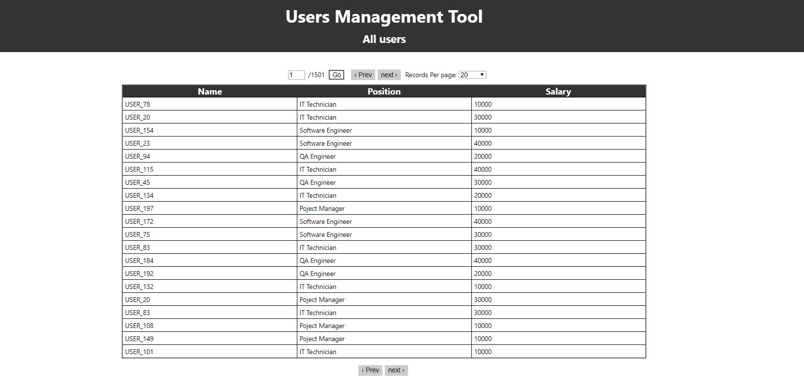

# Pagination
#### Server side: Node.js with express
#### Client side: React

## Run and install:  
npm install  
npm run build  
npm start

## Server
A simple application that reads 2 large json files,   
each file stores information about users.  
the server reads the json files and match users from both files.  
A user can add new records by get request to /addUsers using postman etc.   
I have added a feature that send a push notification to the client when new records are received - using socket.io 
## Client 
display a users table with the data received from the server.  
Becuase of the large size of the json file , i've implemented Pagination.  
UI options:
- next / previos buttons.
- goto specific page number.
- change number of records per page. 
- gets a push notification when new records are received
## UI

